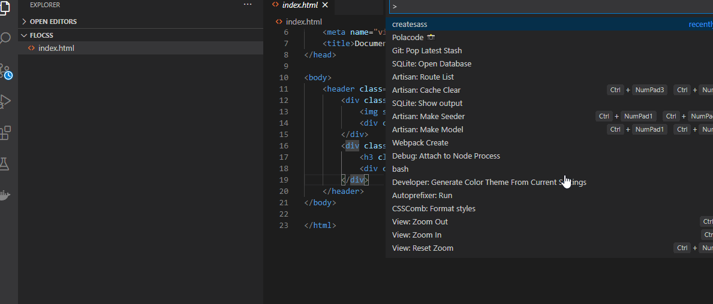

# FLOCSS Helper

A VSCode extension to help code with [FLOCSS](https://github.com/hiloki/flocss).

Welcome to issues,bugs,feature requests,and more.[GitHub Issues](https://github.com/islandryu/flocsshelper/issues)

## Commands

| Command name            | Description                              |
| ----------------------- | ---------------------------------------- |
| flocsshelper.createsass | Create a scss files according to flocss. |

## createsass

